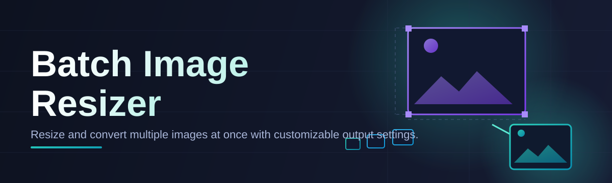
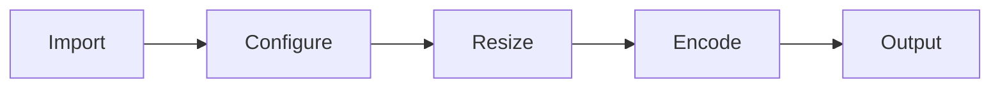

# image-batch-resizer-tool 🖼️⚡

  

*Thousands of images. One drag. Zero patience wasted.*

  

---

## 📌 Overview

Resizing one photo is trivial. Resizing four thousand product shots before a launch deadline is a different beast entirely — and that beast is exactly what **image-batch-resizer-tool** was built to tame. This is a batch image resizer for Windows that processes entire folders of images in one pass: consistent dimensions, consistent format, consistent quality, without you clicking "Save As" a thousand times.

The tool exists because most resizing utilities force a choice between "too simple" (one file at a time, no automation) or "too heavy" (full photo editors with resize buried three menus deep). Neither respects your time. This project sits in the middle: a focused, standalone batch image resizer that does resizing, format conversion, and compression — and nothing it doesn't need to do.

It's built for photographers clearing a memory card, e-commerce teams prepping catalog images, developers generating responsive image sets, and anyone who has ever stared at a folder of 4000×3000 JPEGs and sighed. If your workflow involves "resize all of these, the same way, right now" — this is your tool.

---

## 🔥 What It Actually Does

> [!TIP]
> Every capability below was shaped by one rule: batch operations should be *faster to run than to explain*.

- **Bulk resizing engine** — feed it a folder, get back a folder. Hundreds or thousands of images processed in a single queue.
- **Dimension presets that think ahead** — pixel-exact custom sizes, percentage scaling, or one-click social/web/print presets.
- **Format-aware conversion** — JPEG, PNG, WEBP, BMP in and out. Convert while you resize, no second pass needed.
- **Smart aspect-ratio locking** — stretch-proof scaling that keeps subjects looking like subjects, not funhouse mirrors.
- **Quality/compression dial** — trade file size for fidelity on a per-batch slider, not a hidden default.
- **Filename templating** — sequential numbering, suffixes, prefixes — output files that sort themselves.
- **Non-destructive by default** — originals stay untouched unless you explicitly say otherwise.
- **Drag-and-drop queueing** — no dialogs to hunt through; drop a folder, watch the queue fill.

---

## 🚀 Getting Started

1. **Visit the landing page** using the button above — that's the only official source.

2. **Download** the Windows package for the 2026 release.

3. **Run the executable** — no installer wizard, no background services, no dependency chase.

4. **Drop your images in, pick a preset, hit resize.** Output lands in a destination folder you choose.

> [!NOTE]
> First launch may trigger a Windows SmartScreen prompt because the binary is freshly signed each release cycle. Click "More info" → "Run anyway" if you trust the source (you downloaded from the link above, so you do).

---

## 🖥️ System Requirements

| Requirement | Minimum |
|---|---|
| OS | Windows 10 (64-bit) or Windows 11 |
| RAM | 4 GB (8 GB recommended for 1000+ image batches) |
| Disk | 150 MB free for the app; scratch space for output |
| Dependencies | None — fully standalone executable |
| Internet | Not required after download |

> [!IMPORTANT]
> This is a standalone batch image resizer. There is nothing to install alongside it, no runtime to configure, and no telemetry phoning home in the background.

---

## ⚙️ How It Works

1. **Ingest** — the tool scans the selected folder and builds a file queue, filtering to supported image types.
2. **Configure** — you set target dimensions, output format, and quality once for the whole batch.
3. **Process** — each image is decoded, resized with the chosen algorithm, re-encoded, and written out.
4. **Verify** — a summary log confirms successes and flags anything skipped (corrupt files, unsupported types).
5. **Deliver** — finished images sit in your output folder, ready to ship.

---

## 🧩 Troubleshooting

<strong>My batch stopped partway through — did it lose progress?</strong>

No. Completed files are written as they finish. Re-run the batch on the remaining source files, or check the log for the exact file that failed.

<strong>Output images look softer than the originals.</strong>

You're likely downscaling aggressively with a lower quality setting. Bump the quality slider up, or switch the resampling preset to a sharper algorithm in settings.

<strong>PNG files came out larger than the JPEGs I started with.</strong>

PNG is lossless — it doesn't compress photographic detail the way JPEG does. For photos, convert to JPEG or WEBP during the batch resize for smaller output.

<strong>Windows says the app is from an "unknown publisher."</strong>

Expected for a lean, independently released tool. Verify you downloaded from the official landing page, then proceed past the SmartScreen warning.

<strong>Can I resize images without changing the aspect ratio?</strong>

Yes — aspect-ratio lock is on by default. Turn it off explicitly in settings if you need forced dimensions regardless of stretching.

---

## 🎛️ Interface & Interaction

  

- **Themes** — Light and Dark, switchable instantly, no restart.
- **Keyboard shortcuts**:

  | Shortcut | Action |
  |---|---|
  | `Ctrl+O` | Open folder |
  | `Ctrl+R` | Run batch |
  | `Ctrl+S` | Save preset |
  | `Esc` | Cancel current batch |

- **Settings persistence** — your last-used dimensions, format, and quality are remembered per session.
- **Live queue preview** — thumbnails update as files are added or removed before you commit.

> [!TIP]
> Save frequently-used size/format combos as named presets — a recurring "1200px web export" job becomes a two-click operation.

---

## 🤝 Contributing & Community

Bug reports, feature requests, and pull requests are welcome. Open an issue describing the batch image resizer workflow you're missing, or submit a PR against the current branch.

> [!WARNING]
> Please don't file issues for third-party download mirrors or modified builds — only the official landing page linked in this README is supported.

- Star the repo if it saved you an afternoon of manual resizing.
- Fork it if you want to bend the resizing pipeline to your own workflow.
- Discuss ideas in Issues before large PRs to avoid wasted effort.

---

## 📄 License

Released under the [MIT License](LICENSE), 2026.

---

## ⚠️ Disclaimer

This software is provided "as is," without warranty of any kind. You are responsible for backing up original images before running batch operations. The maintainers are not liable for data loss, corrupted output, or missed deadlines caused by misuse or misconfiguration.

---

## 📝 Changelog

### v2026.1
- Added WEBP output support alongside JPEG/PNG/BMP.
- Improved queue handling for batches over 5,000 files.
- Fixed aspect-ratio lock ignoring custom pixel presets in rare cases.

### v2025.4
- Introduced Dark theme.
- Added filename templating (prefix/suffix/sequential numbering).
- Fixed memory spike on very large source images (>50MP).

### v2025.3
- Initial public standalone release.
- Core batch resize engine, drag-and-drop queueing, basic presets.

